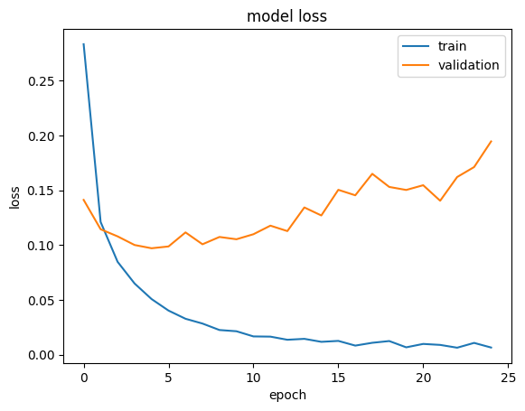

# 📘 Handwritten Digit Classification using ANN

## 📌 Project Summary

This project demonstrates how to classify handwritten digits using an **Artificial Neural Network (ANN)** on the **MNIST dataset**. It includes building a neural network from scratch using TensorFlow/Keras to perform multi-class classification (digits 0–9).

### 📂 Dataset: MNIST
- Contains **60,000** training and **10,000** testing images.
- Each image is **28x28 pixels**, totaling **784 pixels** per image.
- Images are grayscale and represented as pixel values (not actual image files).

---

## 📝 Project Report

This notebook aims to teach how to use an Artificial Neural Network for digit classification. It involves:

- Loading and exploring the MNIST dataset
- Preprocessing and flattening the image pixel data
- Designing and training a multi-layer neural network
- Evaluating performance with accuracy and loss plots
- Making predictions and visualizing model outputs

The project helps learners understand how a simple ANN works in a real-world digit recognition problem.

---

## 🏗️ Model Architecture

A fully connected feed-forward ANN with the following layers:

| Layer Type       | Details                        |
|------------------|--------------------------------|
| Input Layer      | 784 neurons (28x28 pixels)     |
| Hidden Layer 1   | 128 neurons, ReLU activation   |
| Hidden Layer 2   | 32 neurons, ReLU activation    |
| Output Layer     | 10 neurons (softmax for 10 classes: digits 0–9) |

---

## 🧪 Model Training & Evaluation

- **Loss Function**: Categorical Crossentropy  
- **Optimizer**: Adam  
- **Metrics**: Accuracy  
- **Epochs**: 10+ (can be adjusted)
- **Validation**: Model tested on the unseen test dataset

### 🔍 Evaluation Includes:
- Accuracy score
- Loss curves for training and validation
- Confusion matrix
- Sample predictions vs actual digits

---

## 📊 Visualization

The notebook includes:
- Sample digits from the dataset
- Training history (loss & accuracy curves)
- Prediction visualizations

---

## 📈 Results

The ANN model achieves a high accuracy (~97–98%) on the MNIST test dataset, demonstrating its effectiveness for digit classification.

#### 📉 Loss:

#### 📉 Accuracy:

---

> 🤖 "My neural network has trust issues—it always overfits."  
> 🧘‍♂️ "I told my model to relax... now it just drops out randomly."
